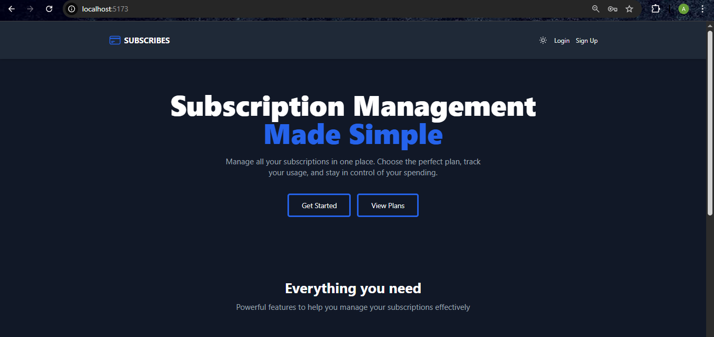
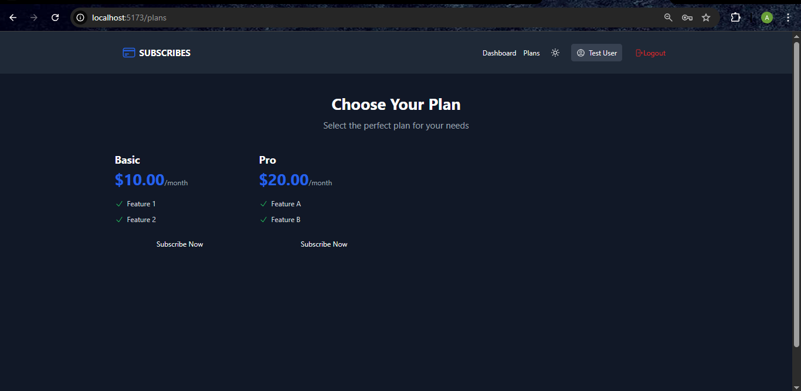
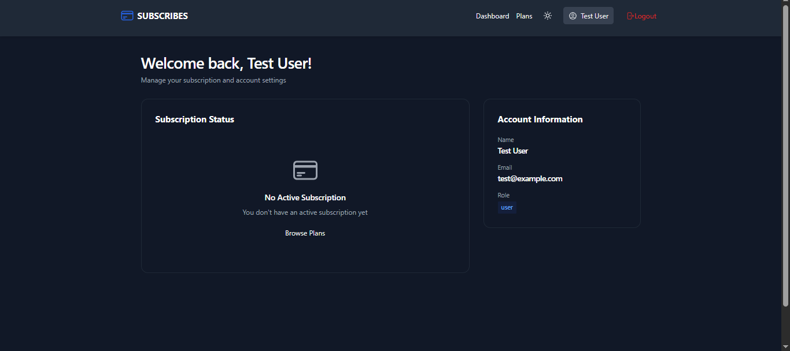
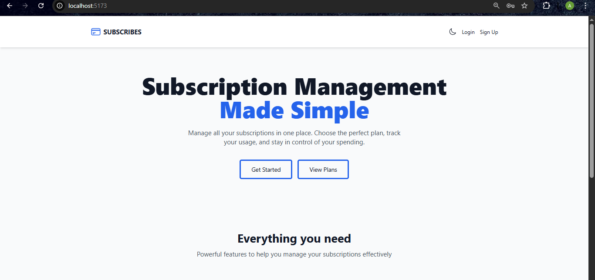
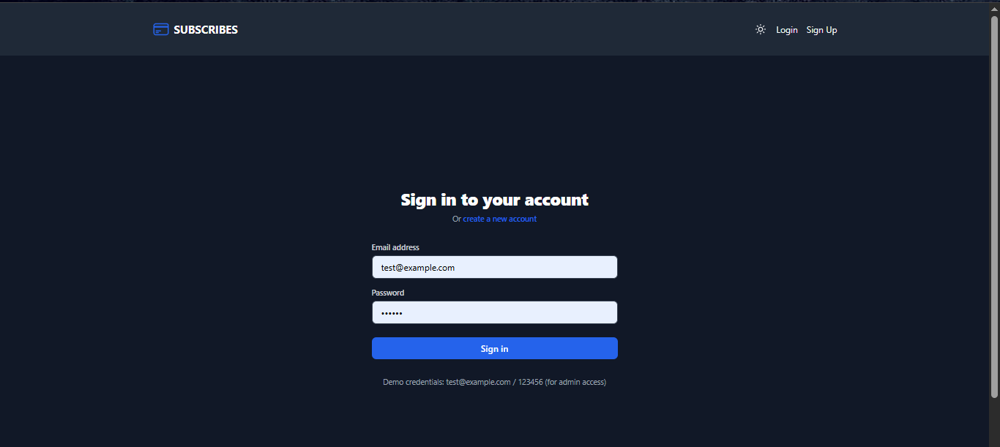

## Project Overview

Subscription Dashboard is a full-stack SaaS-style application built to simulate real-world subscription management systems.

The goal was to design a scalable architecture including authentication, protected routing, role-based access control, and subscription lifecycle management.

Developer Information:

 Name: Abinaya G,
 Email: abinayagovindarajan10@gmail.com,
 github: https://github.com/AbiRaj24/subscription-dashboard-task.git

## Architecture

Frontend:
- React with Vite for fast development
- Redux Toolkit for global auth and theme state
- Protected routes using role-based authorization

Backend:
- REST API built with Express
- JWT authentication with refresh token strategy
- PostgreSQL with Knex query builder
- Joi validation for request schema enforcement

---

#Features

- User authentication (JWT)
- Browse subscription plans
- Subscribe / cancel subscription
- User dashboard
- Admin subscription dashboard
- Protected routes
- Dark / light mode

---

## Technical Decisions

- Used Redux Toolkit instead of Context API for predictable auth state management.
- Implemented role-based ProtectedRoute for admin-only pages.
- Stored theme preference in localStorage for persistent dark mode.
- Structured API services separately for scalability.

## Challenges & Learnings

- Handling token persistence securely across page refresh.
- Managing dark/light theme toggle using Tailwind class strategy.
- Structuring reusable API service layers.
- Debugging Tailwind configuration issues between versions.

## API Endpoints

POST /auth/register
POST /auth/login
GET /plans
POST /subscriptions
GET /admin/subscriptions

screenshots
## Screenshots

### Home Page

### Plans Page

### User Dashboard

### theme toggle

### login Page

### register Page

##project structures##

#folder

--subscription-dashboard-task/
       client/ # React frontend
       server/ # Node.js backend

##backend Setup:

--cd server
--npm install
--cp .env.example .env
  
   ""Update ".env" with your database credentials.Run migrations and seed data"".

--npx knex migrate:latest
--npm run seed

   ""start backend server"

--npm run dev
  
  "http://localhost:5000"

##frontend

--cd client
--npm install
--cp .env.example .env
--npm run dev

 "http://localhost:5173"

 ##notes

- PostgreSQL must be running locally.
- Admin role can be assigned by updating the user role directly in the database.

